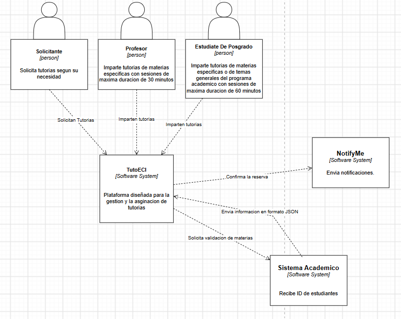
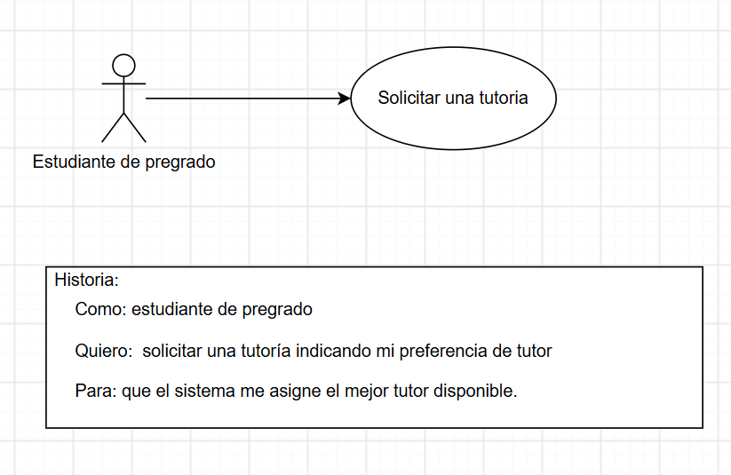
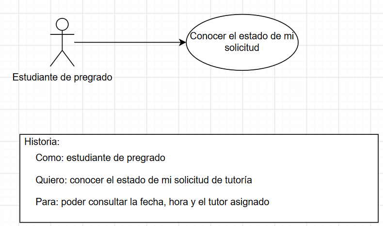

# DOSW_ParcialT1_SergioVega

## 6. Diagramas de contexto

## 7. Requerimientos

### 7.1 Requerimientos funcionales

1. Permitir a los estudiantes de pregrado solicitar tutorias
2. El sistema debe notificar a los estudiantes acerca de si su reserva de tutoria fue asignada y confirmada

### 7.2 Requerimientos no funcionales

1. El sistema debe utilizar la paleta de colores oficial del programa de Ingeniería de Sistemas de la Escuela para TutoECI en todas sus interfaces
2. La interfaz del sistema debe adaptarse a diferentes tamaños de pantalla, incluyendo móviles y computadores de escritorio.

### Criterios de aceptacion

### Requerimiento Funcional 1

| **Campo** | **Descripción** |
| ---------------------------- | ------------------------------------------------------------------------------------- |
| **ID**                       | RF-01 |
| **Nombre del requerimiento** | Solicitar tutoria |
| **Descripción**              | El sistema debe permitir a los solicitantes (estudiantes de pregrado) solicitar  una tutoría indicando mi preferencia de tutor (profesor o estudiante de posgrado). |
| **Precondiciones**           | El solicitante debe estar inscrito a la materia de la que realiza la solicitud |
| **Flujo principal**          | 1. El solicitante selecciona la opción para solicitar una tutoria segun sus necesidades. 2. El sistema solicita la información del estudiante. 3. El sistema verifica la fecha y disponibilidad de los tutores validos. 4. El sistema valida la información. 5. El sistema registra la tutoria. |
| **Diagrama de caso de uso**  |  |
| **Poscondiciones**           | La tutoria queda registrada en el sistema y disponible para revisar |

### Requerimiento Funcional 2

| **Campo** | **Descripción** |
| ---------------------------- | ------------------------------------------------------------------------------------- |
| **ID**                       | RF-02 |
| **Nombre del requerimiento** | Notificar confirmacion |
| **Descripción**              | El sistema debe notificar a los solicitantes (estudiantes de pregrado) despues de haber realizado una solicitud de una tutoría, si esta fue confirmada. |
| **Precondiciones**           | El solicitante debe haber realizado una peticion de tutoria |
| **Flujo principal**          | 1. El sistema verifica que la tutoria exista y confirma que esta sea valida. 2. El sistema envia al estudiante su respectiva confirmacion. |
| **Diagrama de caso de uso**  |  |
| **Poscondiciones**           | El estudiante recibe en su correo la confirmacion de su tutoria |
